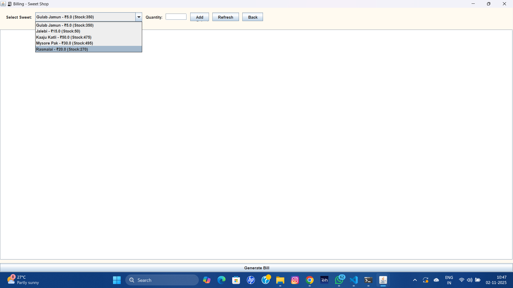
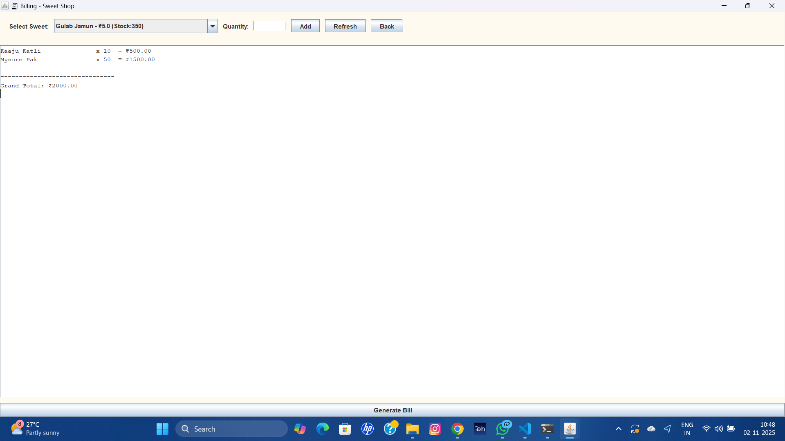
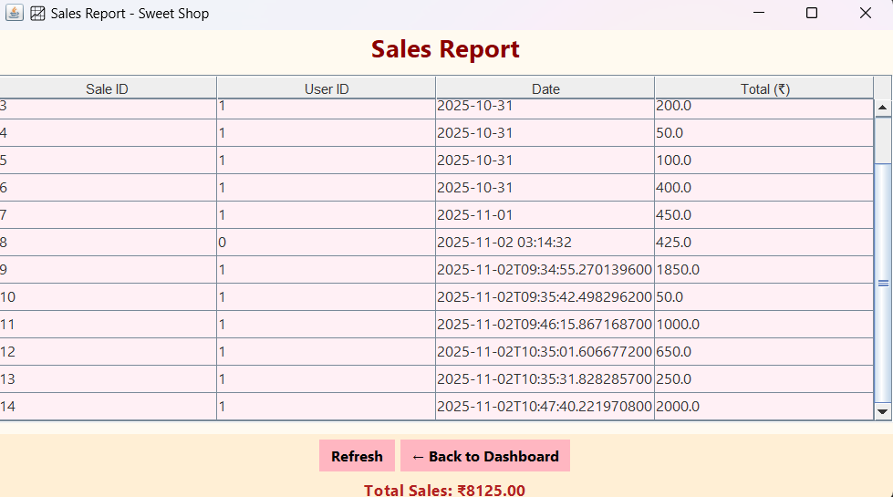

# 🍬 Sweet Shop Management System

**Developer:** Nagaprasad Salian  
**Project Type:** AI Kata / SweetShopManagement Project  
**Language:** Java (Swing + SQLite + iText)  
**Type:** Desktop Application  

---

## 🧾 1. Project Overview

The **Sweet Shop Management System** is a Java-based desktop application designed to help local sweet shops efficiently manage their day-to-day operations.  
The system provides a user-friendly interface for handling **sales, inventory, customers, and staff management**.

### 🎯 Objectives
- Simplify the billing and sales process.
- Manage sweets inventory and stock levels.
- Maintain customer and transaction records.
- Generate PDF invoices for each sale.
- Enable authentication for admins and cashiers.

---

## 🧠 2. System Architecture

The project follows a **layered MVC structure**:
- **Model Layer** → Defines data entities (e.g., User, SweetItem, Customer, Sale).
- **DAO Layer** → Handles all database interactions (SQLite).
- **Service Layer** → Contains the business logic.
- **UI Layer** → Developed using Java Swing for graphical interaction.
- **Utility Layer** → Includes DB connection handling and PDF generation.

---

## 🛠️ 3. Technologies Used

| Component | Technology |
|------------|-------------|
| Programming Language | Java (JDK 17 or above) |
| GUI Framework | Java Swing |
| Database | SQLite |
| ORM | JDBC |
| PDF Generation | iText 5.5.13.3 |
| Testing Framework | JUnit |
| Version Control | Git + GitHub |

---

## 🧩 4. Project Features

| Module | Description |
|----------|-------------|
| 🔐 **User Authentication** | Admin and Cashier registration and login |
| 🏠 **Dashboard** | Central navigation hub |
| 💵 **Billing System** | Add items, calculate total, and generate PDF invoice |
| 📦 **Inventory Management** | Manage sweets list and stock levels |
| 📊 **Reports** | Display total sales and performance summaries |
| 👥 **Customer Management** | Add, update, and delete customer details |
| 👤 **User Management** | Admin can manage cashier accounts |
| 🎨 **Aesthetic UI** | Modern layout with pastel color theme |
| 📄 **Invoice Generator** | Exports detailed bill receipts as PDF |

---

## ⚙️ 5. Setup Instructions (Local Installation)

### 🔹 Step 1 — Prerequisites
Ensure you have:
- **Java JDK 17 or later** installed
- **SQLite** command-line or DB browser
- **Git** (optional, for version control)


## 🖼️ 6. Screenshots  

### 🔐 Login Page  


### 🧾 Registration Page  


### 🏠 Dashboard  


### 🍬 Inventory Management  
  


### 💵 Billing  
  
  


### 📊 Sales Report  


### 👥 Customer Management  


## 7. Clone the Repository
git clone https://github.com/<your-username>/SweetShopManagementSystem.git
cd SweetShopManagementSystem


## 🤖 8. My AI Usage

This project was developed with the assistance of **ChatGPT (OpenAI’s GPT-5)** to enhance efficiency and understanding during the development process.

AI assistance was used for the following tasks:
- Planning the **project architecture** and defining the folder structure.
- Writing and optimizing **Java Swing UI code** for login, billing, and dashboard modules.
- Implementing **database interaction** logic using JDBC and SQLite.
- Generating **boilerplate and repetitive code** (models, DAO, and service classes).
- Debugging and resolving **compilation and runtime errors**.
- Drafting the **README.md documentation** and **test report summary**.
- Improving the **aesthetic layout and UI consistency**.

However:
- All code was **reviewed, understood, and modified** by **Nagaprasad Salian**.
- The **logic, structure, and database design decisions** were made manually by the developer.
- The project represents **original work**, and AI was used purely as a coding assistant, not an autonomous generator of the final system.

**Declaration:**  
I confirm that this project is my own work. AI tools were used responsibly to assist in learning, debugging, and documentation, without compromising originality or understanding.

---

## 🧪 9. Test Report

All test cases were executed successfully using **JUnit 5** (`junit-platform-console-standalone-1.10.2.jar`).

## 🧾 Test Summary

> ℹ️ **Test Execution Results**  
> All tests were executed using **JUnit 5**.  
> Below is a summary of the test outcomes:

| 🧩 **Test Class** | 🧪 **Test Case** | ✅ **Result** |
|-------------------|------------------|----------------|
| **BillingServiceTest** | `testTotalCalculation()` | ✅ Passed |
| **DBConnectionTest** | `testDatabaseConnection()` | ✅ Passed |
| **AuthServiceTest** | `testLoginWithValidUser()` | ✅ Passed |
| **AuthServiceTest** | `testLoginWithInvalidUser()` | ✅ Passed |

> ✅ **Overall Result:** All test cases passed successfully — **100% success rate** 🎯


## 🧪 Test-Driven Development (TDD)

The **Sweet Shop Management System** implements **Test-Driven Development (TDD)** using **JUnit 5**, ensuring that business logic — particularly the billing and inventory operations — is **validated before full integration**.

### 🧩 TDD Approach

Following the **Red → Green → Refactor** cycle:

1. **Red Phase:** Write failing test cases first (no implementation yet).  
2. **Green Phase:** Implement minimal logic to make the test pass.  
3. **Refactor Phase:** Clean and optimize code without changing behavior.  

This process ensures that the core logic (billing, inventory updates, and sales) remains correct, consistent, and bug-free.

---

The **Mock DAO** classes simulate database behavior, allowing tests to run **independently of SQLite**.  
This isolates the logic being tested and ensures **fast, repeatable unit tests**.

---

### 🧪 TDD Test Execution

#### 🔹 Compile the Test Files
```bash
javac -cp ".;out;lib\junit-platform-console-standalone-1.10.2.jar" -d out ^
 src\test\java\com\sweetshop\mockdao\*.java ^
 src\test\java\com\sweetshop\BillingServiceTDDTest.java

Run All Tests
java -jar lib\junit-platform-console-standalone-1.10.2.jar ^
 --class-path "out;lib\sqlite-jdbc-3.50.3.0.jar;lib\itextpdf-5.5.13.3.jar" ^
 --scan-class-path


### 🧰 Test Execution Command
```bash
java -jar lib\junit-platform-console-standalone-1.10.2.jar ^
--class-path "out;lib\sqlite-jdbc-3.50.3.0.jar;lib\itextpdf-5.5.13.3.jar" ^
--scan-class-path

Check installations:
```bash
java --version
sqlite3 --version

...

## — Directory Structure
SweetShopManagementSystem/
│
├── 📂 lib/ # External libraries (JARs)
│ ├── sqlite-jdbc-3.50.3.0.jar
│ ├── itextpdf-5.5.13.3.jar
│ └── junit-platform-console-standalone-1.10.2.jar
│
├── 📂 src/
│ ├── 📂 main/java/com/sweetshop/
│ │ ├── 📂 model/ # Data models
│ │ │ ├── User.java
│ │ │ ├── Customer.java
│ │ │ ├── SweetItem.java
│ │ │ ├── Sale.java
│ │ │ └── SaleItem.java
│ │ │
│ │ ├── 📂 dao/ # Database Access Objects (DAO)
│ │ │ ├── UserDAO.java
│ │ │ ├── CustomerDAO.java
│ │ │ ├── SweetItemDAO.java
│ │ │ ├── SalesDAO.java
│ │ │ └── ReportDAO.java
│ │ │
│ │ ├── 📂 service/ # Business logic layer
│ │ │ ├── AuthService.java
│ │ │ ├── InventoryService.java
│ │ │ ├── BillingService.java
│ │ │ ├── CustomerService.java
│ │ │ └── ReportService.java
│ │ │
│ │ ├── 📂 ui/ # Swing UI components
│ │ │ ├── LoginFrame.java
│ │ │ ├── RegistrationFrame.java
│ │ │ ├── DashboardFrame.java
│ │ │ ├── InventoryFrame.java
│ │ │ ├── BillingFrame.java
│ │ │ ├── ReportFrame.java
│ │ │ └── CustomerFrame.java
│ │ │
│ │ └── 📂 util/ # Utility classes
│ │ ├── DBConnection.java
│ │ └── PDFGenerator.java
│ │
│ ├── 📂 main/resources/
│ │ └── db/
│ │ └── sweetshop.db # SQLite database file
│ │
│ └── 📂 test/java/com/sweetshop/ # Unit and TDD test cases
│ ├── BillingServiceTest.java
│ ├── AuthServiceTest.java
│ ├── DBConnectionTest.java
│ ├── BillingServiceTDDTest.java
│ │
│ ├── 📂 mockdao/ # Mock DAO classes for TDD
│ │ ├── MockSalesDAO.java
│ │ └── MockSweetItemDAO.java
│ │
│ └── 📂 mockmodel/ # Mock model classes (if any)
│ └── (optional test models)
│
├── 📂 screenshots/ # UI screenshots for documentation
│ ├── loginPage.png
│ ├── Registration Page.png
│ ├── Dashboard.png
│ ├── Inventory.png
│ ├── Inventory Item Addition.png
│ ├── CustomerReport.png
│ ├── Billing.png
│ ├── BillingReport.png
│ ├── Billing Report sale Completion.png
│ ├── Invoice Generation.png
│ └── Sales Report.png
│
├── 📂 out/ # Compiled .class output files
│
├── README.md # Project documentation
├── TESTREPORT.md # JUnit & TDD test results summary


###— Compile the Project:

javac -cp ".;lib\sqlite-jdbc-3.50.3.0.jar;lib\itextpdf-5.5.13.3.jar" ^
-d out src\main\java\com\sweetshop\util\*.java ^
src\main\java\com\sweetshop\model\*.java ^
src\main\java\com\sweetshop\dao\*.java ^
src\main\java\com\sweetshop\service\*.java ^
src\main\java\com\sweetshop\ui\*.java


###— Run the Application: 


java -cp ".;out;lib\sqlite-jdbc-3.50.3.0.jar;lib\itextpdf-5.5.13.3.jar" com.sweetshop.ui.LoginFrame


