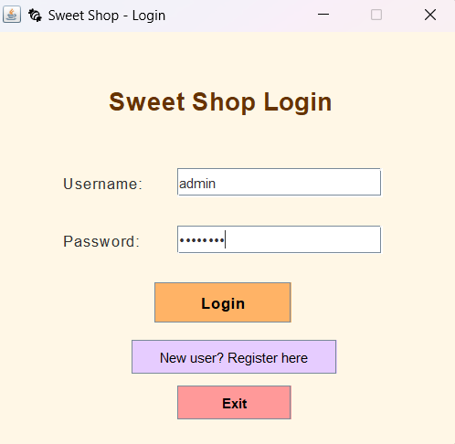
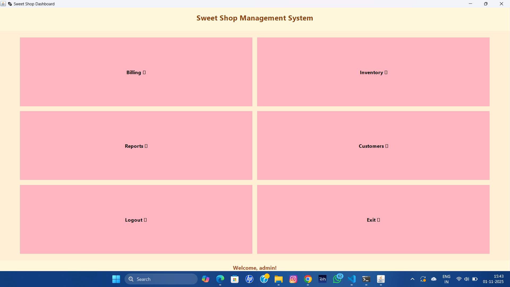
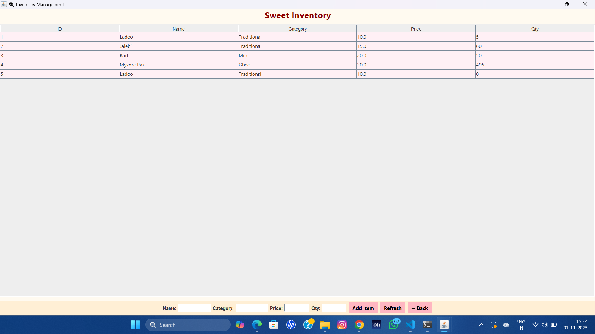
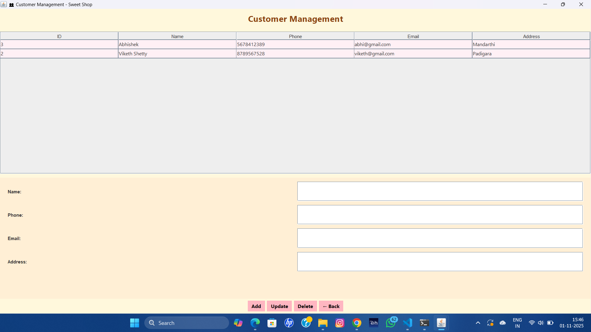

# 🍬 Sweet Shop Management System

**Developer:** Nagaprasad Salian  
**Project Type:** AI Kata / SweetShopManagement Project  
**Language:** Java (Swing + SQLite + iText)  
**Type:** Desktop Application  

---

## 🧾 1. Project Overview

The **Sweet Shop Management System** is a Java-based desktop application designed to help local sweet shops efficiently manage their day-to-day operations.  
The system provides a user-friendly interface for handling **sales, inventory, customers, and staff management**.

### 🎯 Objectives
- Simplify the billing and sales process.
- Manage sweets inventory and stock levels.
- Maintain customer and transaction records.
- Generate PDF invoices for each sale.
- Enable authentication for admins and cashiers.

---

## 🧠 2. System Architecture

The project follows a **layered MVC structure**:
- **Model Layer** → Defines data entities (e.g., User, SweetItem, Customer, Sale).
- **DAO Layer** → Handles all database interactions (SQLite).
- **Service Layer** → Contains the business logic.
- **UI Layer** → Developed using Java Swing for graphical interaction.
- **Utility Layer** → Includes DB connection handling and PDF generation.

---

## 🛠️ 3. Technologies Used

| Component | Technology |
|------------|-------------|
| Programming Language | Java (JDK 17 or above) |
| GUI Framework | Java Swing |
| Database | SQLite |
| ORM | JDBC |
| PDF Generation | iText 5.5.13.3 |
| Testing Framework | JUnit |
| Version Control | Git + GitHub |

---

## 🧩 4. Project Features

| Module | Description |
|----------|-------------|
| 🔐 **User Authentication** | Admin and Cashier registration and login |
| 🏠 **Dashboard** | Central navigation hub |
| 💵 **Billing System** | Add items, calculate total, and generate PDF invoice |
| 📦 **Inventory Management** | Manage sweets list and stock levels |
| 📊 **Reports** | Display total sales and performance summaries |
| 👥 **Customer Management** | Add, update, and delete customer details |
| 👤 **User Management** | Admin can manage cashier accounts |
| 🎨 **Aesthetic UI** | Modern layout with pastel color theme |
| 📄 **Invoice Generator** | Exports detailed bill receipts as PDF |

---

## ⚙️ 5. Setup Instructions (Local Installation)

### 🔹 Step 1 — Prerequisites
Ensure you have:
- **Java JDK 17 or later** installed
- **SQLite** command-line or DB browser
- **Git** (optional, for version control)

Check installations:
-bash
java --version
sqlite3 --version
## 🖼️ 7. Screenshots

### 🧁 Login Page  

### 🏠 Dashboard  

### 🍬 Inventory Management  

### 👥 Customer Management  

### 💵 Billing  

### 📊 Sales Report  

Step 2 — Clone the Repository
git clone https://github.com/<your-username>/SweetShopManagementSystem.git
cd SweetShopManagementSystem

## 🤖 My AI Usage

This project was developed with the assistance of **ChatGPT (OpenAI’s GPT-5)** to enhance efficiency and understanding during the development process.

AI assistance was used for the following tasks:
- Planning the **project architecture** and defining the folder structure.
- Writing and optimizing **Java Swing UI code** for login, billing, and dashboard modules.
- Implementing **database interaction** logic using JDBC and SQLite.
- Generating **boilerplate and repetitive code** (models, DAO, and service classes).
- Debugging and resolving **compilation and runtime errors**.
- Drafting the **README.md documentation** and **test report summary**.
- Improving the **aesthetic layout and UI consistency**.

However:
- All code was **reviewed, understood, and modified** by **Nagaprasad Salian**.
- The **logic, structure, and database design decisions** were made manually by the developer.
- The project represents **original work**, and AI was used purely as a coding assistant, not an autonomous generator of the final system.

**Declaration:**  
I confirm that this project is my own work. AI tools were used responsibly to assist in learning, debugging, and documentation, without compromising originality or understanding.

## — Directory Structure
SweetShopManagementSystem/
│
├── lib/
│   ├── sqlite-jdbc-3.50.3.0.jar
│   └── itextpdf-5.5.13.3.jar
│
├── src/
│   └── main/java/com/sweetshop/
│       ├── model/
│       ├── dao/
│       ├── service/
│       ├── ui/
│       └── util/
│
├── src/main/resources/db/sweetshop.db
├── out/
└── README.md

###— Compile the Project
javac -cp ".;lib\sqlite-jdbc-3.50.3.0.jar;lib\itextpdf-5.5.13.3.jar" ^
-d out src\main\java\com\sweetshop\util\*.java ^
src\main\java\com\sweetshop\model\*.java ^
src\main\java\com\sweetshop\dao\*.java ^
src\main\java\com\sweetshop\service\*.java ^
src\main\java\com\sweetshop\ui\*.java

— Run the Application
java -cp ".;out;lib\sqlite-jdbc-3.50.3.0.jar;lib\itextpdf-5.5.13.3.jar" com.sweetshop.ui.LoginFrame

